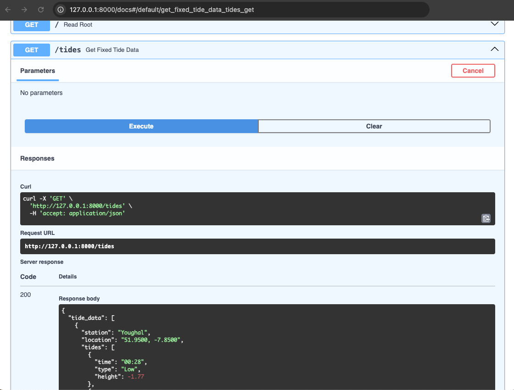
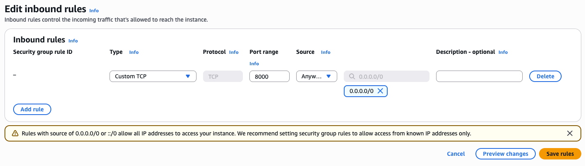

# Deploy a FastAPI microservice to AWS EC2 using Uvicorn

This guide shows you how to deploy a FastAPI microservice to AWS EC2. The service fetches data from a third-party API, processes the response, and exposes it through a RESTful endpoint. While the API used in this example uses a free tidal data API, the same pattern can be applied to any data-driven API.

## Deploy the FastAPI microservice locally

Before deploying to EC2, test your app locally to make sure everything runs as expected.

### Prerequisites

Before you begin, make sure you have the following installed:

- Python 3.10 or later
- `pip`
- A free API key from [WorldTides](https://www.worldtides.info/register)

### Step 1: Clone the GitHub project

Clone the GitHub project containing the Python, environment, and requirements files:

```bash
git clone git@github.com:carolinemaymaguirecmm/about.git
cd about/docs/projects/fast-dsp-microservice
```

### Step 2: Set up and activate a virtual environment

```bash
python3 -m venv venv
source venv/bin/activate
```

\newpage

### Step 3: Install dependencies

```bash
pip install -r requirements.txt
```

### Step 4: Add your API Key

Open the `.env` file and replace the placeholder with your WorldTides API key:

```env
TIDE_API_KEY=your_api_key_here
```

### Step 5: Start the API server

Run the FastAPI app using Uvicorn:

```bash
uvicorn main:app --reload
```

You should see output similar to the following:

```bash
INFO:     Uvicorn running on http://127.0.0.1:8000
```

### Step 6: View the endpoint in your browser

When you visit [http://localhost:8000/tides](http://localhost:8000/tides), you'll receive the following JSON response:

```json
{
  "tide_data": [
    {
      "station": "Youghal",
      "location": "51.9500, -7.8500",
      "tides": [
        {
          "time": "01:13",
          "type": "Low",
          "height": -1.72
        },
        {
          "time": "06:58",
          "type": "High",
          "height": 1.67
        }
      ]
    }
  ]
}

```

> **Note**  
> This endpoint returns tide data for three nearby stations. The number of stations is limited to avoid exceeding free-tier API limits. You can change the base location, the radius, or the station limit by modifying `main.py`.

### Explore FastAPI documentation features

FastAPI includes automatically generated interactive API documentation. You can explore and test your API using the following interfaces:

- **Swagger UI**: [http://localhost:8000/docs](http://localhost:8000/docs)
- **ReDoc**: [http://localhost:8000/redoc](http://localhost:8000/redoc)



## Deploy a FastAPI microservice to AWS EC2

Follow these steps to deploy the microservice to the cloud using Amazon EC2.

### Step 1: Launch an EC2 instance

1. Go to the [AWS Management Console](https://console.aws.amazon.com/).
2. Launch a new EC2 instance with the following configuration:

      - **AMI**: Ubuntu Server 22.04 LTS
      - **Instance type**: `t2.micro`
      - **Key pair**: Create a new key pair and download the `.pem` file.
  
3. Click **Launch instance**.
4. After launch, navigate to **EC2 > Instances**, select your instance, and copy the **Public IPv4 address**.

### Step 2: Configure the security group

AWS EC2 blocks all incoming traffic to your EC2 instance. To access your FastAPI app from a browser, you must allow traffic on the port Uvicorn uses. By default, this value is `8000`.

1. In the EC2 Console, open your instance and scroll to the **Security** section.
2. Click the security group name.
3. Select the **Inbound rules** tab and click **Edit inbound rules**.
4. Click **Add rule**, then enter the following values:
      - **Type**: Custom TCP
      - **Port range**: `8000`
      - **Source**: `<your-ip-address>` or `0.0.0.0/0`
5. Click **Save rules**.



> **Important**  
> For security, restrict access by using your IP as the source instead of `0.0.0.0/0`. Only use `0.0.0.0/0` to allow public access during short testing periods.

### Step 3: SSH into the instance

Use SSH to connect to your EC2 instance. Replace `<your-key-name>` with your `.pem` file name and `<your-ec2-public-ip>` with the instance’s public IPv4 address:

```bash
ssh -i <your-key-name>.pem ubuntu@<your-ec2-public-ip>
```

### Step 4: Set up the environment on EC2

Update the package index and install Python and Git:

```bash
sudo apt update && sudo apt install -y python3 python3-pip python3-venv git
```

### Step 5: Clone the GitHub project

Clone the GitHub repository containing the project files:

```bash
git clone https://github.com/carolinemaymaguirecmm/about.git
cd about/docs/projects/fast-dsp-microservice
```

### Step 6: Set up and run

Create and activate a virtual environment, then install the required Python packages:

```bash
python3 -m venv venv
source venv/bin/activate
pip install -r requirements.txt
```

### Step 7: Add your API key

Open the `.env` file and add your WorldTides API key:

```bash
nano .env
```

Then add the following line:

```env
TIDE_API_KEY=your_api_key_here
```

### Step 8: Start FastAPI with public access

Start the FastAPI server with the following command:

```bash
uvicorn main:app --host 0.0.0.0 --port 8000
```

Once the server is running, visit: `http://<your-ec2-public-ip>/tides`

You should see a JSON response with tide data from the nearest stations.

Your FastAPI microservice is now live and accessible on AWS EC2. For additional tips on how to enhance your deployment, refer to the official [FastAPI deployment guide](https://fastapi.tiangolo.com/deployment/).
